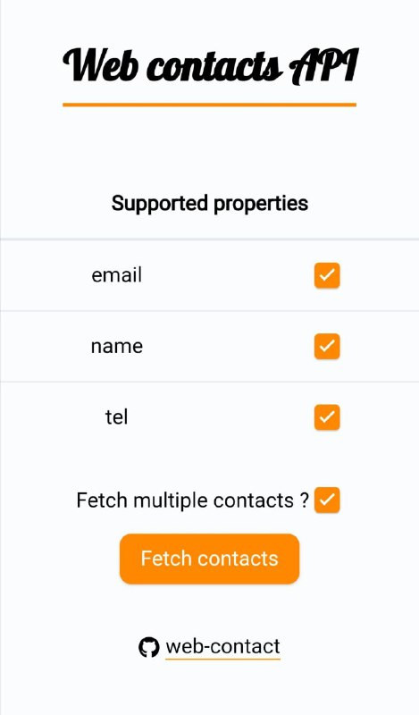

# web-contact 📒

Simple example using the [Web Contacts API](https://wicg.github.io/contact-api/spec/)

🚀 Live demo : https://pierresaid.github.io/web-contact

For now it only works with Google Chrome Android 80+



## Project setup

```
yarn install
```

### Compiles and hot-reloads for development

```
yarn serve
```

The project is served in https by default as the Web contacts API only works in https
